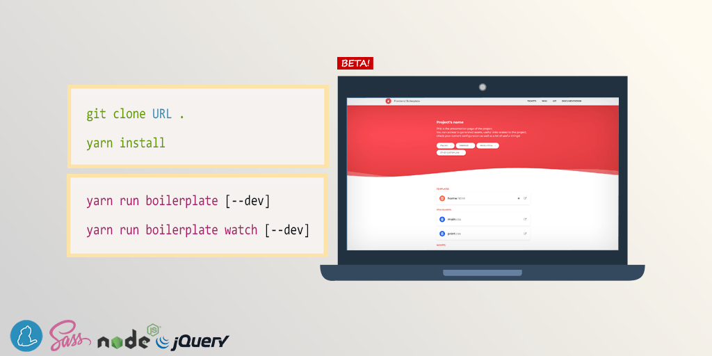

# Frontend Boilerplate

Minimalist and ready to use frontEnd HTML5/CSS/JS Boilerplate for creating new web projects.

# Getting Started

These instructions will help you run the project on a live system or on your local machine for 
development and testing purposes.

## Dependencies

First, make sure these are installed on your machine :

- [Node.js](http://nodejs.org) 10.15.1
- [NPM](https://www.npmjs.com/) 6.4.1
- [Yarn](https://yarnpkg.com/) 1.13.0

## Quick start

In bash/terminal/command line, `cd` into your project directory.

1. Clone this repo or download zip.
2. Run `yarn install` to install required files. (Add --no-bin-links if on VirtualBox.)
3. When it's done installing, run one of the task runners to get going :
	- `yarn run boilerplate [--dev]` manually compiles HTML/CSS/JS files.
	- `yarn run boilerplate watch [--dev] [--reload]` automatically compiles HTML/CSS/JS and spies on files changes.
	
Consider using the `--dev` option for development and testing purposes **only**.

If you have any issue with `yarn install` on Windows, run the CLI as administrator and execute the following command :
`npm install -g --production windows-build-tools && npm rebuild`. Then close & open the CLI and try again.

:+1: :rocket: :+1: :rocket: :+1: :rocket: :+1: :rocket: :+1: :rocket: :+1: :rocket: :+1:

# Configuration

Everything you need is in *boilerplate-includes/frontendboilerplate-configuration.js*.

# Documentation

`yarn run boilerplate [--dev]` : Builds HTML/CSS/JS files and checks code.

`yarn run boilerplate watch [--dev] [--reload]` : Builds HTML/CSS/JS files, checks code and spies on files changes.

---

`yarn run boilerplate check-js` : Checks JavaScript syntax.

`yarn run boilerplate check-scss` : Checks Scss syntax.

`yarn run boilerplate javascript [--dev]` : Builds JavaScript code.

`yarn run boilerplate css [--dev]` : Builds CSS stylesheets.

`yarn run boilerplate html [--dev]` : Builds html templates and perform W3C validation.

`yarn run boilerplate gitignore` : Builds custom .gitignore according to *boilerplate-includes/.gitignore*.

---

`yarn run boilerplate imagemin [--lossless]` : Optimises .jpg .jpeg .png .gif .svg .webp images.

`yarn run boilerplate favicon [--skip-prompt] [--dev]` : Creates and attach favicon files.

---

`yarn run boilerplate clean` : Erases generated assets.

##### External stuffs

- [Use external libraries with Yarn](./external-libraries.md)
- [CMS/Framework Integration](./cms-framework.md)
- [Modernizr features detection](./modernizr.md)

##### Tools

- [SCSS custom functions, mixins, image dimensions, inline assets](./scss-functions.md)

##### Linting

- [SCSS lint - How to bypass check-scss warnings](./scss-lint.md)
- [JSHint - How to bypass check-js warnings](./jshint.md)

##### Javascript-based plugins

- [Plugin: Built-in JavaScript viewport informations (boilerplate_display)](./viewport-framework.md)
- [Plugin: Responsive/Retina/Lazyload image](./responsive-image-plugin.md)
- [Plugin: Lazyload Iframe](./lazyload-iframe.md)
- [Plugin: Detect New Html Elements](./detect-new-html-elements.md)

# Maintenance

Update outdated NPM dependencies :

`yarn upgrade-interactive --latest` (Add --no-bin-links if on VirtualBox.)

# Authors

  

# License

Copyright (c) [Fidesio](https://www.fidesio.com/) and Contributors. All Rights Reserved.
